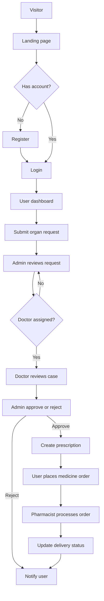
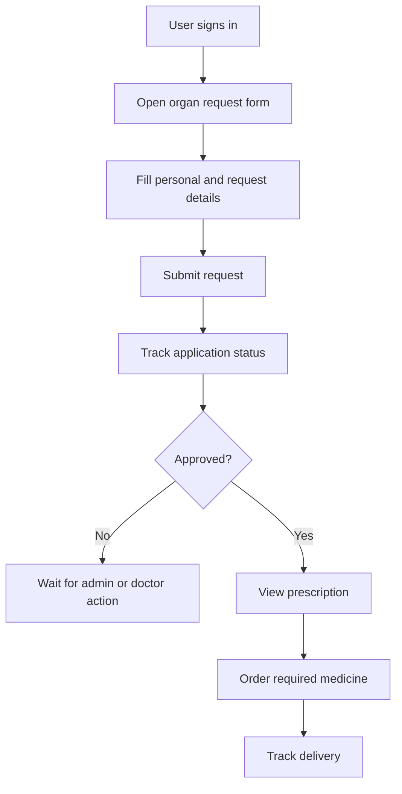
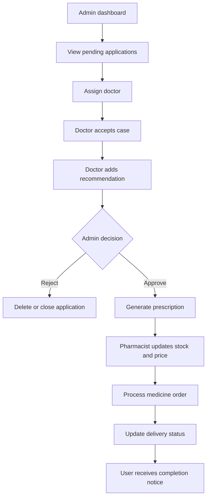
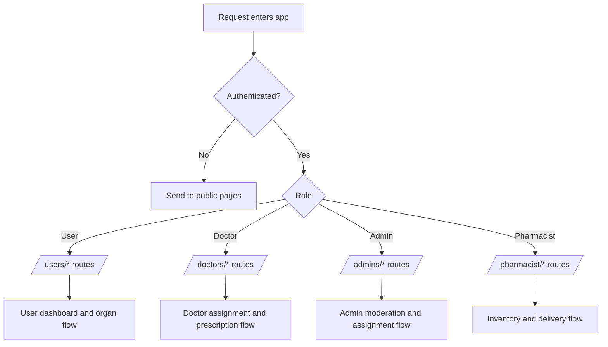

<p align="center">
  
</p>

<h1 align="center">web-based-organ-donation-system</h1>

<p align="center"><i>Role-based organ donation workflow app powered by PHP, MySQL, Bootstrap, and jQuery.</i></p>

<p align="center">
  
  
  
</p>

<p align="center">
  
  
  
  
  
</p>

<p align="center">
  <a href="#-project-intro"></a>
  <a href="#-install-methods"></a>
  <a href="#-entry-points"></a>
</p>

## web-based-organ-donation-system — README

Role-based PHP/MySQL web application for organ request management, doctor review, admin approval workflow, and prescription-to-medicine fulfillment.

## Table of Contents

- [🚀 Project intro](#-project-intro)
- [📁 Project structure](#-project-structure)
- [⭐ Differentiators](#-differentiators)
- [🔧 Features](#-features)
  - [🧭 Flow diagrams](#-flow-diagrams)
- [🧰 Tech stack](#-tech-stack)
- [⚙️ Install methods](#-install-methods)
  - [📦 XAMPP / WAMP / LAMP (Apache + PHP + MySQL)](#-xampp--wamp--lamp-apache--php--mysql)
- [🔐 Configuration](#-configuration)
- [🗄️ Database structure](#-database-structure)
- [📜 Entry points](#-entry-points)
- [🚀 Deployment notes](#-deployment-notes)
- [🤝 Contributing](#-contributing)
- [📄 License](#-license)

## 🚀 Project intro

`web-based-organ-donation-system` is a multi-role healthcare workflow app with:

- User registration/login and organ application submission
- Admin review, doctor assignment, and final approve/reject actions
- Doctor recommendation and prescription generation
- Pharmacist medicine inventory and order processing
- End-to-end medicine ordering and delivery status tracking

It is designed as an academic/project-friendly foundation for organ donation and associated treatment operations.

## 📁 Project structure

```txt
Web-based-Organ-Donation-System/
├── index.html
├── style.css
├── README.md
├── LICENSE
├── Image/
├── admins/
│   ├── dashboard.php
│   ├── adminsignin.php / adminsignup.php
│   ├── accept.php / doctorassign.php / assign.php
│   ├── addpharmacy.php
│   ├── userdelete.php / doctordelete.php / applicationdelete.php
│   ├── inc/
│   │   ├── config.php
│   │   └── head.php
│   ├── css/ js/ images/ fonts/
│   └── ...
├── users/
│   ├── dashboard.php
│   ├── signin.php / signup.php
│   ├── organ.php
│   ├── ordermedicine.php / ordermedicinepannel.php
│   ├── usercomment.php / userpriceacceptreject.php
│   ├── css/ images/ fonts/
│   └── ...
├── doctors/
│   ├── doctorshomepage.php
│   ├── doctorsignin.php / doctorsignup.php
│   ├── accept.php
│   ├── prescription.php
│   ├── inc/
│   │   ├── config.php
│   │   └── head.php
│   ├── css/ js/ images/ fonts/
│   └── ...
└── pharmacist/
    ├── dashboard.php
    ├── pharmacistsignin.php / pharmacistsignup.php
    ├── addmedicine.php / medicinedetailsupdate.php
    ├── priceupdate.php / deliverystatuschange.php
    ├── inc/
    │   ├── config.php
    │   └── head.php
    ├── css/ js/ images/
    └── ...
```

## ⭐ Differentiators

- Full role separation (`Admin`, `User`, `Doctor`, `Pharmacist`) with dedicated dashboards
- Practical workflow from organ request → doctor recommendation → admin decision
- Integrated post-approval prescription and pharmacy order lifecycle
- Bootstrap-based UI with modal-driven dashboard operations

## 🔧 Features

### Core features

| Feature | Status | Notes |
| --- | --- | --- |
| User authentication | ✅ Current | Signup/signin/logout for users |
| Admin authentication | ✅ Current | Admin account management and dashboard access |
| Doctor authentication | ✅ Current | Doctor signup/signin and assigned application view |
| Pharmacist authentication | ✅ Current | Pharmacist signup/signin and medicine/order handling |
| Organ application | ✅ Current | Users submit organ requests with date/reason |
| Doctor assignment | ✅ Current | Admin assigns doctors to pending applications |
| Application decision | ✅ Current | Admin approves/rejects applications |
| Recommendation flow | ✅ Current | Doctors write recommendation/decision for assigned cases |
| Prescription flow | ✅ Current | Doctors create prescriptions for approved cases |
| Medicine order flow | ✅ Current | Users place orders from prescriptions |
| Pharmacy operations | ✅ Current | Stock updates, pricing, comments, delivery updates |

### 🧭 Flow diagrams

#### 1) End-to-end application journey



#### 2) User request flow



#### 3) Admin, doctor, and pharmacy workflow



#### 4) Route access control flow



### Route protection behavior

- Public entry: `/index.html`
- Admin routes: `/admins/*` (requires admin session)
- User routes: `/users/*` (requires user session)
- Doctor routes: `/doctors/*` (requires doctor session)
- Pharmacist routes: `/pharmacist/*` (requires pharmacist session)

## 🧰 Tech stack

- **Backend:** PHP (procedural style with mysqli)
- **Database:** MySQL / MariaDB
- **Frontend:** HTML, CSS, Bootstrap, JavaScript, jQuery
- **Hosting target:** Apache + PHP runtime (XAMPP/WAMP/LAMP compatible)

## ⚙️ Install methods

### 📦 XAMPP / WAMP / LAMP (Apache + PHP + MySQL)

Prerequisites:

- PHP 7.4+ (or newer)
- MySQL/MariaDB
- Apache web server

```bash
git clone https://github.com/rootcode-creator/Web-based-Organ-Donation-System.git
cd Web-based-Organ-Donation-System
```

1) Copy project into your web root (`htdocs` / `www`).

2) Create/import the MySQL database schema used by this project.

3) Configure database connection in each role config file:

- `admins/inc/config.php`
- `doctors/inc/config.php`
- `pharmacist/inc/config.php`

4) Start Apache + MySQL.

5) Open `http://localhost/Web-based-Organ-Donation-System/`.

## 🔐 Configuration

This project does not use `.env` by default. It uses direct DB config in PHP files:

```php
$host = "localhost";
$dbUsername = "your_db_user";
$dbPassword = "your_db_password";
$dbName = "your_db_name";
```

Notes:

- Keep all role config files synchronized.
- Never commit real production credentials.
- Rotate any exposed credentials before deployment.

## 🗄️ Database structure

Main tables used in codebase:

- `users`
- `admins`
- `doctors`
- `pharmacist`
- `pharmacy`
- `organ`
- `prescription`
- `ordermedicine`
- `stockmedicine`

Typical workflow:

- `users` submit to `organ`
- `admins` assign doctor (`organ.doctor_info`) and set application status
- `doctors` write recommendations and insert into `prescription`
- `users` place orders into `ordermedicine`
- `pharmacist` updates `stockmedicine`, pricing, comments, and delivery status

## 📜 Entry points

- Landing page: `index.html`
- Admin login: `admins/adminsignin.html`
- User login: `users/signin.html`
- Doctor login: `doctors/doctorsignin.html`
- Pharmacist login: `pharmacist/pharmacistsignin.html`

## 🚀 Deployment notes

- Ensure all module-level `config.php` files point to the same database.
- Use HTTPS and secure session settings in production.
- Add server-side validation/sanitization hardening before public deployment.
- Move credentials from source files to environment variables for safer operations.

## 🤝 Contributing

- Fork the repository and create a focused feature branch.
- Keep pull requests scoped and include verification steps.
- Never commit credentials, secrets, or production config.

## 📄 License

This project is licensed under the MIT License. See the `LICENSE` file for details.